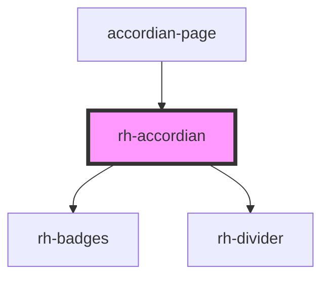

# rh-accordian

## How to use


```
 <rh-accordian
    text="First Accordian"
    content="Hey hiii am opned!!!"
  />
```

<!-- Auto Generated Below -->


## Properties

| Property     | Attribute | Description | Type                    | Default     |
| ------------ | --------- | ----------- | ----------------------- | ----------- |
| `accordions` | --        |             | `BasicAccordionModel[]` | `undefined` |


## Events

| Event     | Description | Type               |
| --------- | ----------- | ------------------ |
| `onClick` |             | `CustomEvent<any>` |


## Dependencies

### Used by

 - [accordian-page](../../../page/accordian.page)

### Depends on

- [rh-badges](../../badges/rh-badges)
- [rh-divider](../../dividers/rh-divider.molecule)

### Graph


----------------------------------------------

*Built with [StencilJS](https://stenciljs.com/)*
