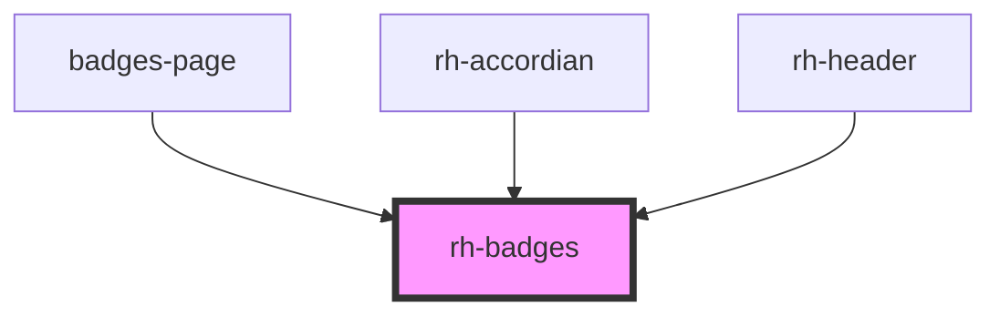

# rh-tab

<!-- Auto Generated Below -->

## Properties

| Property       | Attribute        | Description | Type      | Default     |
| -------------- | ---------------- | ----------- | --------- | ----------- |
| `badgeBgColor` | `badge-bg-color` |             | `string`  | `undefined` |
| `badgeRound`   | `badge-round`    |             | `boolean` | `false`     |
| `badgeStatus`  | `badge-status`   |             | `string`  | `undefined` |
| `badgetitle`   | `badgetitle`     |             | `string`  | `undefined` |

## Events

| Event        | Description | Type               |
| ------------ | ----------- | ------------------ |
| `checkEvent` |             | `CustomEvent<any>` |

## Dependencies

### Used by

 - [badges-page](../../../page/badges.page)
 - [rh-accordian](../../accordian/rh-accordian.molecule)
 - [rh-header](../../header/rh-header.molecule)

### Graph

----------------------------------------------

*Built with [StencilJS](https://stenciljs.com/)*
