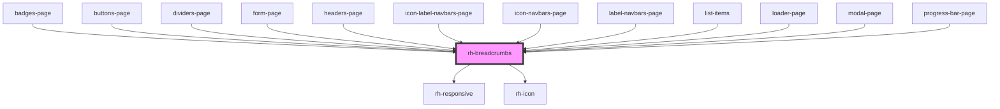

# rh-breadcrumbs

## How to use

```
  <rh-breadcrumbs
    [breadcrumbs]="navigationStack"
    (goBack)="navigateTo($event.detail)"
    (goBackTo)="navigateTo($event.detail)"
  ></rh-breadcrumbs>
```
<!-- Auto Generated Below -->


## Properties

| Property      | Attribute | Description | Type       | Default |
| ------------- | --------- | ----------- | ---------- | ------- |
| `breadcrumbs` | --        |             | `string[]` | `[]`    |


## Events

| Event      | Description | Type               |
| ---------- | ----------- | ------------------ |
| `goBack`   |             | `CustomEvent<any>` |
| `goBackTo` |             | `CustomEvent<any>` |


## Dependencies

### Used by

 - [badges-page](../../../page/badges.page)
 - [buttons-page](../../../page/buttons.page)
 - [dividers-page](../../../page/dividers.page)
 - [form-page](../../../page/form.page)
 - [headers-page](../../../page/headers.page)
 - [icon-label-navbars-page](../../../page/navbars-list.page/icon-label-navbars.page)
 - [icon-navbars-page](../../../page/navbars-list.page/icon-navbars.page)
 - [label-navbars-page](../../../page/navbars-list.page/label-navbars.page)
 - [list-items](../../../page/list-items.page)
 - [loader-page](../../../page/loader.page)
 - [modal-page](../../../page/modal.page)
 - [progress-bar-page](../../../page/progress-bar.page)

### Depends on

- [rh-responsive](../../responsive/rh-responsive.molecule)
- [rh-icon](../../rh-icon/rh-icon.molecule)

### Graph


----------------------------------------------

*Built with [StencilJS](https://stenciljs.com/)*
