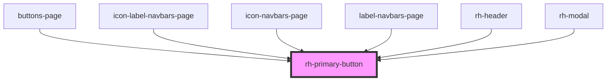

# rh-primary-button

## How to use


```
  <rh-primary-button
    id='rh-primary-button_1'
    text='mehr'
    icon="icon icon-next"
    ctaButton={true}
    disabled={false}
    onButtonClicked={(event: any) => this.checkEvent(event)}
  />
```

<!-- Auto Generated Below -->


## Properties

| Property            | Attribute           | Description | Type      | Default     |
| ------------------- | ------------------- | ----------- | --------- | ----------- |
| `bgcolor`           | `bgcolor`           |             | `string`  | `undefined` |
| `color`             | `color`             |             | `string`  | `undefined` |
| `ctabutton`         | `ctabutton`         |             | `boolean` | `false`     |
| `disabled`          | `disabled`          |             | `boolean` | `false`     |
| `icon`              | `icon`              |             | `string`  | `undefined` |
| `iconbutton`        | `iconbutton`        |             | `boolean` | `false`     |
| `iconsecondary`     | `iconsecondary`     |             | `boolean` | `false`     |
| `secondary`         | `secondary`         |             | `boolean` | `false`     |
| `standard`          | `standard`          |             | `boolean` | `false`     |
| `text`              | `text`              |             | `string`  | `undefined` |
| `transparentbutton` | `transparentbutton` |             | `boolean` | `false`     |


## Events

| Event           | Description | Type               |
| --------------- | ----------- | ------------------ |
| `buttonClicked` |             | `CustomEvent<any>` |


## Dependencies

### Used by

 - [buttons-page](../../../page/buttons.page)
 - [icon-label-navbars-page](../../../page/navbars-list.page/icon-label-navbars.page)
 - [icon-navbars-page](../../../page/navbars-list.page/icon-navbars.page)
 - [label-navbars-page](../../../page/navbars-list.page/label-navbars.page)
 - [rh-header](../../header/rh-header.molecule)
 - [rh-modal](../../modal/rh-modal)

### Graph


----------------------------------------------

*Built with [StencilJS](https://stenciljs.com/)*
