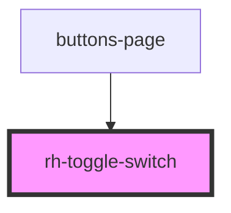

# rh-toggle-switch

## How to use

```
  <rh-toggle-switch
    id='rh-toggle-switch_1'
    leftText='on'
    rightText='off'
    disabled={false}
    border={true}
    checked={true}
    onSwitchClick={(event: any) => this.checkEvent(event)}
  />
```

<!-- Auto Generated Below -->


## Properties

| Property    | Attribute    | Description | Type      | Default     |
| ----------- | ------------ | ----------- | --------- | ----------- |
| `border`    | `border`     |             | `boolean` | `false`     |
| `checked`   | `checked`    |             | `boolean` | `false`     |
| `disabled`  | `disabled`   |             | `boolean` | `false`     |
| `leftText`  | `left-text`  |             | `string`  | `undefined` |
| `rightText` | `right-text` |             | `string`  | `undefined` |


## Events

| Event         | Description | Type               |
| ------------- | ----------- | ------------------ |
| `switchClick` |             | `CustomEvent<any>` |


## Dependencies

### Used by

 - [buttons-page](../../../page/buttons.page)

### Graph


----------------------------------------------

*Built with [StencilJS](https://stenciljs.com/)*
