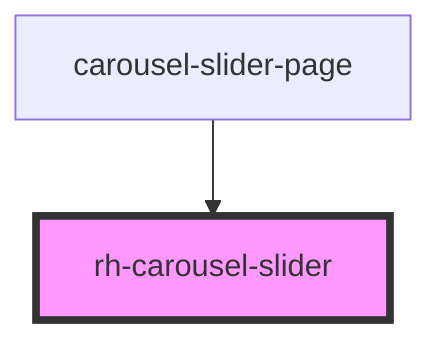

# rh-slider

## How to use

```
  <rh-slider
  id="rh-slider_2"
  [steps]="steps"
  [padding]="true"
  [colorBg]="'grey'"
  ></rh-slider>
```

<!-- Auto Generated Below -->


## Properties

| Property    | Attribute  | Description | Type                   | Default     |
| ----------- | ---------- | ----------- | ---------------------- | ----------- |
| `carousels` | --         |             | `BasicCarouselModel[]` | `undefined` |
| `colorBg`   | `color-bg` |             | `string`               | `undefined` |
| `padding`   | `padding`  |             | `boolean`              | `undefined` |


## Dependencies

### Used by

 - [carousel-slider-page](../../../page/carousel-slider.page)

### Graph


----------------------------------------------

*Built with [StencilJS](https://stenciljs.com/)*
