# rh-divider

## How to use

```

  <rh-divider
  [hrShow]="true"
  [background]="false"
  [fullWidth]="true"
  ></rh-divider>

```

<!-- Auto Generated Below -->


## Properties

| Property     | Attribute    | Description | Type      | Default     |
| ------------ | ------------ | ----------- | --------- | ----------- |
| `background` | `background` |             | `boolean` | `undefined` |
| `bigSize`    | `big-size`   |             | `boolean` | `undefined` |
| `fullWidth`  | `full-width` |             | `boolean` | `undefined` |
| `hrShow`     | `hr-show`    |             | `boolean` | `undefined` |
| `icon`       | `icon`       |             | `string`  | `undefined` |
| `logoText`   | `logo-text`  |             | `boolean` | `undefined` |
| `padding`    | `padding`    |             | `boolean` | `undefined` |
| `text`       | `text`       |             | `string`  | `undefined` |


## Events

| Event     | Description | Type               |
| --------- | ----------- | ------------------ |
| `checked` |             | `CustomEvent<any>` |


## Dependencies

### Used by

 - [accordian-page](../../../page/accordian.page)
 - [badges-page](../../../page/badges.page)
 - [buttons-page](../../../page/buttons.page)
 - [carousel-slider-page](../../../page/carousel-slider.page)
 - [dividers-page](../../../page/dividers.page)
 - [form-page](../../../page/form.page)
 - [headers-page](../../../page/headers.page)
 - [icon-label-navbars-page](../../../page/navbars-list.page/icon-label-navbars.page)
 - [icon-navbars-page](../../../page/navbars-list.page/icon-navbars.page)
 - [label-navbars-page](../../../page/navbars-list.page/label-navbars.page)
 - [list-items](../../../page/list-items.page)
 - [loader-page](../../../page/loader.page)
 - [modal-page](../../../page/modal.page)
 - [navbars-list-page](../../../page/navbars-list.page)
 - [onboarding-page](../../../page/onboarding.page)
 - [progress-bar-page](../../../page/progress-bar.page)
 - [rh-accordian](../../accordian/rh-accordian.molecule)
 - [rh-list-item-badge](../../list items/rh-list-item-badge.molecule)
 - [rh-list-item-primary](../../list items/rh-list-item-primary.molecule)

### Graph

```mermaid
graph TD;
  accordian-page --> rh-divider
  badges-page --> rh-divider
  buttons-page --> rh-divider
  carousel-slider-page --> rh-divider
  dividers-page --> rh-divider
  form-page --> rh-divider
  headers-page --> rh-divider
  icon-label-navbars-page --> rh-divider
  icon-navbars-page --> rh-divider
  label-navbars-page --> rh-divider
  list-items --> rh-divider
  loader-page --> rh-divider
  modal-page --> rh-divider
  navbars-list-page --> rh-divider
  onboarding-page --> rh-divider
  progress-bar-page --> rh-divider
  rh-accordian --> rh-divider
  rh-list-item-badge --> rh-divider
  rh-list-item-primary --> rh-divider
  style rh-divider fill:#f9f,stroke:#333,stroke-width:4px
```


----------------------------------------------

*Built with [StencilJS](https://stenciljs.com/)*
