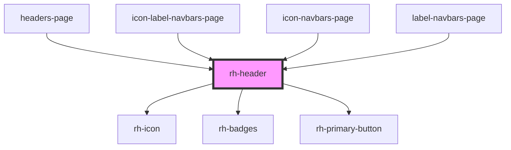

# rh-header

# How to use

```
 <rh-header
    headertitle="Title"
    innerpageheader={true}
    righticon={true}
    onBackButtonAction={(event: any) => this.checkEvent(event)}
    onButtonAction={(event: any) => this.clickEvent(event)}
  />
```

<!-- Auto Generated Below -->


## Properties

| Property          | Attribute         | Description | Type      | Default     |
| ----------------- | ----------------- | ----------- | --------- | ----------- |
| `backicon`        | `backicon`        |             | `boolean` | `false`     |
| `badgeActive`     | `badge-active`    |             | `boolean` | `undefined` |
| `badgeBgColor`    | `badge-bg-color`  |             | `string`  | `undefined` |
| `badgeStatus`     | `badge-status`    |             | `string`  | `undefined` |
| `badgetitle`      | `badgetitle`      |             | `string`  | `undefined` |
| `deviceOnline`    | `device-online`   |             | `boolean` | `true`      |
| `headertitle`     | `headertitle`     |             | `string`  | `undefined` |
| `icon`            | `icon`            |             | `string`  | `undefined` |
| `innerpageheader` | `innerpageheader` |             | `boolean` | `false`     |
| `righticon`       | `righticon`       |             | `boolean` | `false`     |
| `subtitle`        | `subtitle`        |             | `string`  | `undefined` |


## Events

| Event              | Description | Type               |
| ------------------ | ----------- | ------------------ |
| `backButtonAction` |             | `CustomEvent<any>` |
| `buttonAction`     |             | `CustomEvent<any>` |


## Dependencies

### Used by

 - [headers-page](../../../page/headers.page)
 - [icon-label-navbars-page](../../../page/navbars-list.page/icon-label-navbars.page)
 - [icon-navbars-page](../../../page/navbars-list.page/icon-navbars.page)
 - [label-navbars-page](../../../page/navbars-list.page/label-navbars.page)

### Depends on

- [rh-icon](../../rh-icon/rh-icon.molecule)
- [rh-badges](../../badges/rh-badges)
- [rh-primary-button](../../buttons/rh-primary-button.molecule)

### Graph


----------------------------------------------

*Built with [StencilJS](https://stenciljs.com/)*
