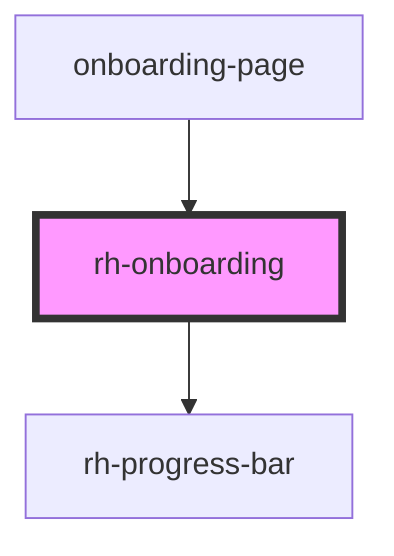

# rh-tab

<!-- Auto Generated Below -->

## Properties

| Property        | Attribute        | Description | Type                | Default     |
| --------------- | ---------------- | ----------- | ------------------- | ----------- |
| `activeIndex`   | `active-index`   |             | `string`            | `undefined` |
| `boardingSteps` | --               |             | `OnBoardingModel[]` | `undefined` |
| `progressValue` | `progress-value` |             | `string`            | `undefined` |

## Events

| Event         | Description | Type               |
| ------------- | ----------- | ------------------ |
| `clickHandle` |             | `CustomEvent<any>` |
| `nextAction`  |             | `CustomEvent<any>` |
| `prevAction`  |             | `CustomEvent<any>` |

## Dependencies

### Used by

 - [onboarding-page](../../../page/onboarding.page)

### Depends on

- [rh-progress-bar](../../progress-bar/rh-progress-bar)

### Graph

----------------------------------------------

*Built with [StencilJS](https://stenciljs.com/)*
