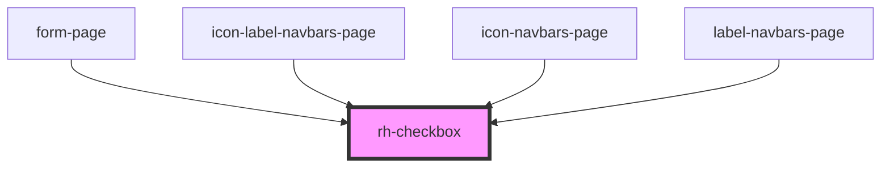

# rh-checkbox

# How to use

```
 <rh-checkbox-rectangular-error-handling
    id='rh-rectangular-checkbox-form_2'
    left={true}
    padding={true}
    text="click me"
    checked={true}
    disabled={false}
    textError='Please accept the terms of use in order to continue to the next steps.'
    isFormComponent={true}
    formController={this.form.controllers[0].properties}
    onChanged={(event: CustomEvent<any>) =>
      this.handleChange(event.detail.currentValue, this.form.controllers[0].name)
    }
  ></rh-checkbox-rectangular-error-handling>
```

<!-- Auto Generated Below -->


## Properties

| Property          | Attribute           | Description | Type                | Default     |
| ----------------- | ------------------- | ----------- | ------------------- | ----------- |
| `checked`         | `checked`           |             | `boolean`           | `undefined` |
| `disabled`        | `disabled`          |             | `boolean`           | `false`     |
| `formController`  | --                  |             | `ControlProperties` | `undefined` |
| `isFormComponent` | `is-form-component` |             | `boolean`           | `false`     |
| `left`            | `left`              |             | `boolean`           | `true`      |
| `padding`         | `padding`           |             | `boolean`           | `false`     |
| `text`            | `text`              |             | `string`            | `undefined` |
| `textError`       | `text-error`        |             | `string`            | `undefined` |


## Events

| Event      | Description | Type               |
| ---------- | ----------- | ------------------ |
| `changed`  |             | `CustomEvent<any>` |
| `onChange` |             | `CustomEvent<any>` |


## Dependencies

### Used by

 - [form-page](../../../page/form.page)
 - [icon-label-navbars-page](../../../page/navbars-list.page/icon-label-navbars.page)
 - [icon-navbars-page](../../../page/navbars-list.page/icon-navbars.page)
 - [label-navbars-page](../../../page/navbars-list.page/label-navbars.page)

### Graph


----------------------------------------------

*Built with [StencilJS](https://stenciljs.com/)*
