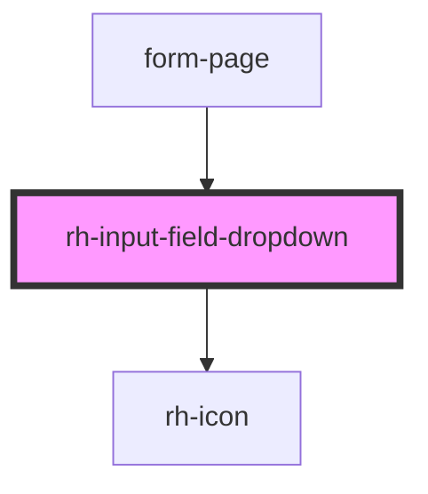

# rh-input-field-dropdown

## How to use

```
<rh-input-field-dropdown
  id='rh-input-field-dropdown_1'
  padding={true}
  label='Label'
  value={this.inputText}
  elementlist={this.dropdownList}
  placeholder='Please select'
  isFormComponent={true}
  formController={this.dropdownFormController.properties}
  onUpdate={(event: CustomEvent<any>) =>
    this.handleChange(event.detail.value.titleUp, this.dropdownFormController.name)
  }
></rh-input-field-dropdown>
```

<!-- Auto Generated Below -->


## Properties

| Property          | Attribute           | Description | Type                | Default     |
| ----------------- | ------------------- | ----------- | ------------------- | ----------- |
| `elementlist`     | --                  |             | `DropdownElement[]` | `undefined` |
| `formController`  | --                  |             | `ControlProperties` | `undefined` |
| `isFormComponent` | `is-form-component` |             | `boolean`           | `false`     |
| `label`           | `label`             |             | `string`            | `undefined` |
| `opened`          | `opened`            |             | `boolean`           | `undefined` |
| `padding`         | `padding`           |             | `boolean`           | `undefined` |
| `placeholder`     | `placeholder`       |             | `string`            | `undefined` |
| `value`           | `value`             |             | `string`            | `undefined` |


## Events

| Event    | Description | Type                             |
| -------- | ----------- | -------------------------------- |
| `update` |             | `CustomEvent<InputDropdownEmit>` |


## Dependencies

### Used by

 - [form-page](../../../page/form.page)

### Depends on

- [rh-icon](../../rh-icon/rh-icon.molecule)

### Graph


----------------------------------------------

*Built with [StencilJS](https://stenciljs.com/)*
