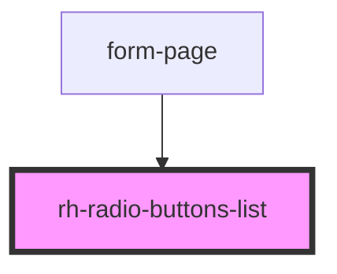

# rh-radio-buttons-list

## How to use

```
  <rh-radio-buttons-list
    id='rh-radio-buttons-list_1'
    title='Show radio buttons on mobile devices'
    radioButtonList={this.radioButtonList}
    formController={this.form.controllers[1].properties}
    isFormComponent={true}
    padding={true}
    disabled={true}
    onRadioCheck={(event: any) => { }}
    onChanged={(event: CustomEvent<any>) =>
      this.handleChange(event.detail.currentValue, this.form.controllers[1].name)
    }
  ></rh-radio-buttons-list>
```

<!-- Auto Generated Below -->


## Properties

| Property          | Attribute           | Description | Type                | Default               |
| ----------------- | ------------------- | ----------- | ------------------- | --------------------- |
| `disabled`        | `disabled`          |             | `boolean`           | `false`               |
| `formController`  | --                  |             | `ControlProperties` | `undefined`           |
| `hasMargin`       | `has-margin`        |             | `boolean`           | `true`                |
| `inputTitle`      | `title`             |             | `string`            | `undefined`           |
| `isFormComponent` | `is-form-component` |             | `boolean`           | `false`               |
| `padding`         | `padding`           |             | `boolean`           | `undefined`           |
| `radioButtonList` | --                  |             | `RadioButton[]`     | `undefined`           |
| `radioPosition`   | `radio-position`    |             | `string`            | `'left' \|\| 'right'` |
| `showDesktopCol`  | `show-desktop-col`  |             | `boolean`           | `false`               |


## Events

| Event        | Description | Type                            |
| ------------ | ----------- | ------------------------------- |
| `changed`    |             | `CustomEvent<ResultValidation>` |
| `radioCheck` |             | `CustomEvent<any>`              |


## Dependencies

### Used by

 - [form-page](../../../page/form.page)

### Graph


----------------------------------------------

*Built with [StencilJS](https://stenciljs.com/)*
