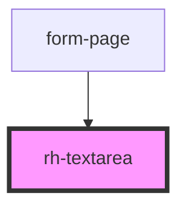

# rh-textarea

## How to use

```

  <rh-textarea
    id='rh-textarea_1'
    padding={true}
    title='Label'
    text='Mr Montanari cut the line at the roundabout trying to take over. I had to break and lost control of my Multipla, ending on the guard rail'
    onUpdatedText={(event: any) => this.checkEvent(event)}
    placeholder='Placeholder...'
  ></rh-textarea>


```

<!-- Auto Generated Below -->


## Properties

| Property         | Attribute     | Description | Type      | Default     |
| ---------------- | ------------- | ----------- | --------- | ----------- |
| `componentTitle` | `title`       |             | `string`  | `undefined` |
| `maxLenght`      | `max-lenght`  |             | `number`  | `undefined` |
| `padding`        | `padding`     |             | `boolean` | `undefined` |
| `placeholder`    | `placeholder` |             | `string`  | `undefined` |
| `text`           | `text`        |             | `string`  | `''`        |


## Events

| Event         | Description | Type               |
| ------------- | ----------- | ------------------ |
| `updatedText` |             | `CustomEvent<any>` |


## Dependencies

### Used by

 - [form-page](../../../page/form.page)

### Graph


----------------------------------------------

*Built with [StencilJS](https://stenciljs.com/)*
