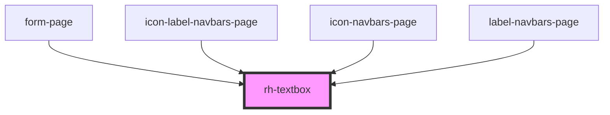

# rh-textbox

## How to use

```

  <rh-textbox
    id='rh-textbox_1'
    disabled={false}
    label='Name'
    type='text'
    isFormComponent={true}
    formController={this.inputFormController.properties}
    onUpdate={event => this.handleChange(event.detail, this.inputFormController.name)}
    showCustomError={this.showCustomError}
    errorText='the text should be "api-response"'
    error={false}
    placeholder='Insert your name'
    padding={true}
  ></rh-textbox>

```

<!-- Auto Generated Below -->


## Properties

| Property                | Attribute                | Description | Type                   | Default     |
| ----------------------- | ------------------------ | ----------- | ---------------------- | ----------- |
| `areResultscategorized` | `are-resultscategorized` |             | `boolean`              | `false`     |
| `calendarActive`        | `calendar-active`        |             | `boolean`              | `false`     |
| `calendarHourActive`    | `calendar-hour-active`   |             | `boolean`              | `false`     |
| `dateDisable`           | --                       |             | `any[]`                | `undefined` |
| `disabled`              | `disabled`               |             | `boolean`              | `false`     |
| `error`                 | `error`                  |             | `boolean`              | `undefined` |
| `errorText`             | `error-text`             |             | `string`               | `undefined` |
| `formController`        | --                       |             | `ControlProperties`    | `undefined` |
| `hourDisabled`          | --                       |             | `any[]`                | `undefined` |
| `instructionText`       | `instruction-text`       |             | `string`               | `undefined` |
| `isFormComponent`       | `is-form-component`      |             | `boolean`              | `false`     |
| `label`                 | `label`                  |             | `string`               | `''`        |
| `mask`                  | `mask`                   |             | `string`               | `''`        |
| `maskActive`            | `mask-active`            |             | `boolean`              | `undefined` |
| `maxDate`               | `max-date`               |             | `string`               | `undefined` |
| `maxHour`               | `max-hour`               |             | `string`               | `undefined` |
| `maxlength`             | `maxlength`              |             | `number`               | `undefined` |
| `minDate`               | `min-date`               |             | `string`               | `undefined` |
| `minHour`               | `min-hour`               |             | `string`               | `undefined` |
| `ngModelVar`            | `ng-model-var`           |             | `string`               | `''`        |
| `padding`               | `padding`                |             | `boolean`              | `undefined` |
| `placeholder`           | `placeholder`            |             | `string`               | `''`        |
| `setHour`               | `set-hour`               |             | `string`               | `undefined` |
| `showCustomError`       | `show-custom-error`      |             | `boolean`              | `undefined` |
| `showError`             | `show-error`             |             | `boolean`              | `false`     |
| `sugestions`            | --                       |             | `string[]`             | `[]`        |
| `sugestionsCatergories` | --                       |             | `CategorizedResults[]` | `[]`        |
| `type`                  | `type`                   |             | `string`               | `'text'`    |


## Events

| Event        | Description | Type               |
| ------------ | ----------- | ------------------ |
| `checkEvent` |             | `CustomEvent<any>` |
| `emitDate`   |             | `CustomEvent<any>` |
| `emitHour`   |             | `CustomEvent<any>` |
| `onFocus`    |             | `CustomEvent<any>` |
| `update`     |             | `CustomEvent<any>` |


## Dependencies

### Used by

 - [form-page](../../../page/form.page)
 - [icon-label-navbars-page](../../../page/navbars-list.page/icon-label-navbars.page)
 - [icon-navbars-page](../../../page/navbars-list.page/icon-navbars.page)
 - [label-navbars-page](../../../page/navbars-list.page/label-navbars.page)

### Graph


----------------------------------------------

*Built with [StencilJS](https://stenciljs.com/)*
