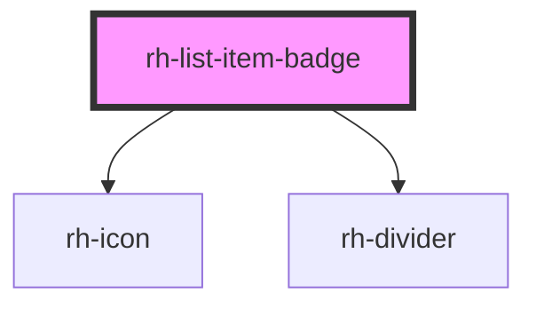

# rh-list-item-primary

## How to use

```
  <rh-list-item-primary
    id="rh-list-item-primary_1"
    [title]="'Pension e Wealth'"
    [padding]="true"
    [subtitle1]="
      'Rehau list item'
    "
    [icon]="'ios-arrow-forward'"
    [badgetitle]="'Attivo'"
    [badgeActive]="false"
    [badgeStatus]="true"
    [iconActive]="true"
    [toggleActive]="false"
    [tooltipActive]="false"
    (checkEvent)="checkEvent($event)"
    (statusUpdate)="checkEvent($event)"
  ></rh-list-item-primary>

```

<!-- Auto Generated Below -->


## Properties

| Property         | Attribute          | Description | Type      | Default     |
| ---------------- | ------------------ | ----------- | --------- | ----------- |
| `badgeActive`    | `badge-active`     |             | `boolean` | `undefined` |
| `badgeBgColor`   | `badge-bg-color`   |             | `string`  | `undefined` |
| `badgeStatus`    | `badge-status`     |             | `boolean` | `undefined` |
| `badgetitle`     | `badgetitle`       |             | `string`  | `undefined` |
| `colorBg`        | `color-bg`         |             | `string`  | `undefined` |
| `elements`       | `elements`         |             | `string`  | `undefined` |
| `firstTitle`     | `title`            |             | `string`  | `undefined` |
| `icon`           | `icon`             |             | `string`  | `undefined` |
| `iconLeftActive` | `icon-left-active` |             | `boolean` | `undefined` |
| `iconRight`      | `icon-right`       |             | `boolean` | `true`      |
| `nested`         | `nested`           |             | `boolean` | `false`     |
| `padding`        | `padding`          |             | `boolean` | `undefined` |
| `status`         | `status`           |             | `boolean` | `true`      |
| `subtitle`       | `subtitle`         |             | `string`  | `undefined` |


## Events

| Event          | Description | Type               |
| -------------- | ----------- | ------------------ |
| `checkEvent`   |             | `CustomEvent<any>` |
| `statusUpdate` |             | `CustomEvent<any>` |


## Dependencies

### Depends on

- [rh-icon](../../rh-icon/rh-icon.molecule)
- [rh-divider](../../dividers/rh-divider.molecule)

### Graph


----------------------------------------------

*Built with [StencilJS](https://stenciljs.com/)*
