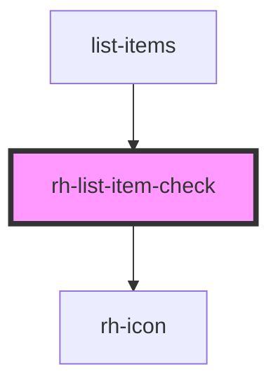

# rh-list-item-primary

## How to use

```
  <rh-list-item-primary
    id='rh-list-item-primary_5'
    title='Durchfluss'
    subtitle="subtitle"
    padding={true}
    icon='icon-next'
    onCheckEvent={(event: any) => this.checkEvent(event)}
    onStatusUpdate={(event: any) => this.checkEvent(event)}
  />

```

<!-- Auto Generated Below -->


## Properties

| Property   | Attribute | Description | Type                   | Default     |
| ---------- | --------- | ----------- | ---------------------- | ----------- |
| `itemList` | --        |             | `ListItemVariation3[]` | `undefined` |


## Events

| Event          | Description | Type               |
| -------------- | ----------- | ------------------ |
| `checkEvent`   |             | `CustomEvent<any>` |
| `statusUpdate` |             | `CustomEvent<any>` |


## Dependencies

### Used by

 - [list-items](../../../page/list-items.page)

### Depends on

- [rh-icon](../../rh-icon/rh-icon.molecule)

### Graph


----------------------------------------------

*Built with [StencilJS](https://stenciljs.com/)*
