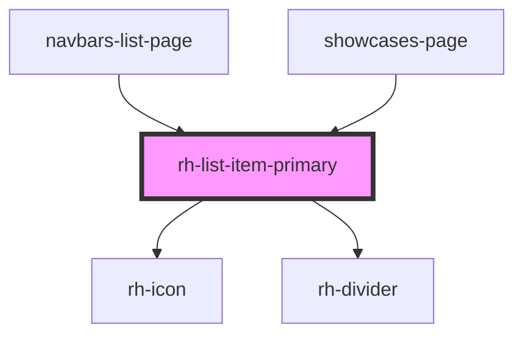

# rh-list-item-primary

## How to use

```
  <rh-list-item-primary
    id='rh-list-item-primary_5'
    title='Durchfluss'
    subtitle="subtitle"
    padding={true}
    icon='icon-next'
    onCheckEvent={(event: any) => this.checkEvent(event)}
    onStatusUpdate={(event: any) => this.checkEvent(event)}
  />

```

<!-- Auto Generated Below -->


## Properties

| Property     | Attribute    | Description | Type      | Default     |
| ------------ | ------------ | ----------- | --------- | ----------- |
| `colorBg`    | `color-bg`   |             | `string`  | `undefined` |
| `elements`   | `elements`   |             | `string`  | `undefined` |
| `firstTitle` | `title`      |             | `string`  | `undefined` |
| `icon`       | `icon`       |             | `string`  | `undefined` |
| `iconRight`  | `icon-right` |             | `boolean` | `true`      |
| `nested`     | `nested`     |             | `boolean` | `false`     |
| `padding`    | `padding`    |             | `boolean` | `undefined` |
| `status`     | `status`     |             | `boolean` | `true`      |
| `subtitle`   | `subtitle`   |             | `string`  | `undefined` |


## Events

| Event          | Description | Type               |
| -------------- | ----------- | ------------------ |
| `checkEvent`   |             | `CustomEvent<any>` |
| `statusUpdate` |             | `CustomEvent<any>` |


## Dependencies

### Used by

 - [navbars-list-page](../../../page/navbars-list.page)
 - [showcases-page](../../../page/showcases.page)

### Depends on

- [rh-icon](../../rh-icon/rh-icon.molecule)
- [rh-divider](../../dividers/rh-divider.molecule)

### Graph


----------------------------------------------

*Built with [StencilJS](https://stenciljs.com/)*
