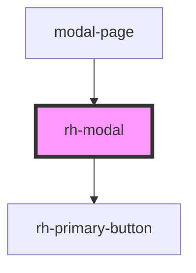

# rh-tab

<!-- Auto Generated Below -->

## Properties

| Property       | Attribute       | Description | Type     | Default     |
| -------------- | --------------- | ----------- | -------- | ----------- |
| `actionText`   | `action-text`   |             | `string` | `undefined` |
| `modalHeader`  | `modal-header`  |             | `string` | `undefined` |
| `modalMessage` | `modal-message` |             | `string` | `undefined` |

## Dependencies

### Used by

 - [modal-page](../../../page/modal.page)

### Depends on

- [rh-primary-button](../../buttons/rh-primary-button.molecule)

### Graph

----------------------------------------------

*Built with [StencilJS](https://stenciljs.com/)*
