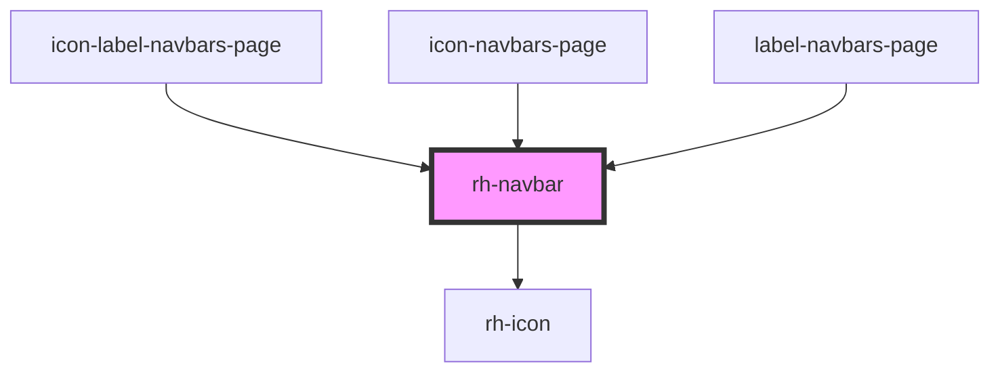

# rh-navbar

## How to use

```
  <rh-navbar
  id='rh-navbar_1'
  tabs={this.tabsThreeElements}
  onOnClick={(event: any) => this.checkEvent(event)}
  >
    <div slot="tab1" class="tab-container">
      <div>Slot 1 content</div>
    </div>
    <div slot="tab2" class="tab-container">
      <div>Slot 2 content</div>
    </div>
    <div slot="tab3" class="tab-container">
      <div>Slot 3 content</div>
    </div>
  </rh-navbar>
        
```

<!-- Auto Generated Below -->


## Properties

| Property | Attribute | Description | Type                       | Default     |
| -------- | --------- | ----------- | -------------------------- | ----------- |
| `tabs`   | --        |             | `HorizontalTabMenuModel[]` | `undefined` |


## Events

| Event     | Description | Type               |
| --------- | ----------- | ------------------ |
| `onClick` |             | `CustomEvent<any>` |


## Dependencies

### Used by

 - [icon-label-navbars-page](../../../page/navbars-list.page/icon-label-navbars.page)
 - [icon-navbars-page](../../../page/navbars-list.page/icon-navbars.page)
 - [label-navbars-page](../../../page/navbars-list.page/label-navbars.page)

### Depends on

- [rh-icon](../../rh-icon/rh-icon.molecule)

### Graph


----------------------------------------------

*Built with [StencilJS](https://stenciljs.com/)*
