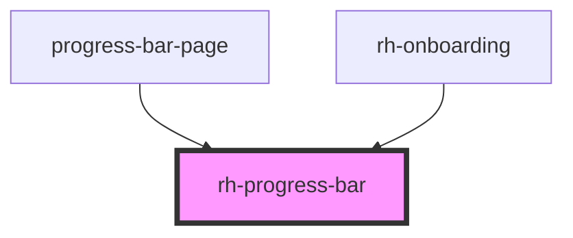

# rh-tab

<!-- Auto Generated Below -->

## Properties

| Property                | Attribute                 | Description | Type      | Default     |
| ----------------------- | ------------------------- | ----------- | --------- | ----------- |
| `ProgressContentHidden` | `progress-content-hidden` |             | `boolean` | `false`     |
| `progressAmount`        | `progress-amount`         |             | `string`  | `"0"`       |
| `progressColor`         | `progress-color`          |             | `string`  | `undefined` |
| `progressHeight`        | `progress-height`         |             | `string`  | `'231px'`   |
| `progressWidth`         | `progress-width`          |             | `string`  | `'234px'`   |

## Dependencies

### Used by

 - [progress-bar-page](../../../page/progress-bar.page)
 - [rh-onboarding](../../onboarding/rh-onboarding)

### Graph

----------------------------------------------

*Built with [StencilJS](https://stenciljs.com/)*
