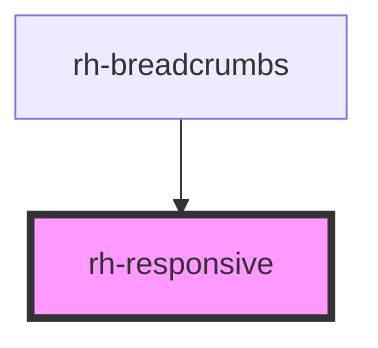

# rh-responsive

<!-- Auto Generated Below -->

## Properties

| Property      | Attribute | Description | Type                   | Default     |
| ------------- | --------- | ----------- | ---------------------- | ----------- |
| `breakpoints` | --        |             | `(string \| number)[]` | `undefined` |

## Dependencies

### Used by

 - [rh-breadcrumbs](../../breadcrumbs/rh-breadcrumbs.molecule)

### Graph

----------------------------------------------

*Built with [StencilJS](https://stenciljs.com/)*
