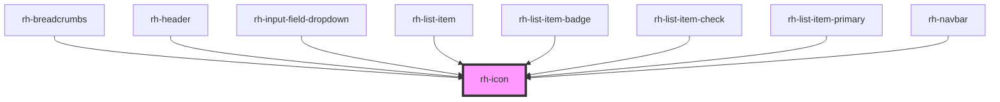

# rh-icon

<!-- Auto Generated Below -->

## Properties

| Property | Attribute | Description | Type     | Default     |
| -------- | --------- | ----------- | -------- | ----------- |
| `color`  | `color`   |             | `string` | `undefined` |
| `name`   | `name`    |             | `string` | `undefined` |
| `size`   | `size`    |             | `string` | `undefined` |

## Dependencies

### Used by

 - [rh-breadcrumbs](../../breadcrumbs/rh-breadcrumbs.molecule)
 - [rh-header](../../header/rh-header.molecule)
 - [rh-input-field-dropdown](../../inputs/rh-input-field-dropdown.molecule)
 - [rh-list-item](../../list items/rh-list-item.molecule)
 - [rh-list-item-badge](../../list items/rh-list-item-badge.molecule)
 - [rh-list-item-check](../../list items/rh-list-item-check.molecule)
 - [rh-list-item-primary](../../list items/rh-list-item-primary.molecule)
 - [rh-navbar](../../navbar-items/rh-navbar.molecule)

### Graph

----------------------------------------------

*Built with [StencilJS](https://stenciljs.com/)*
