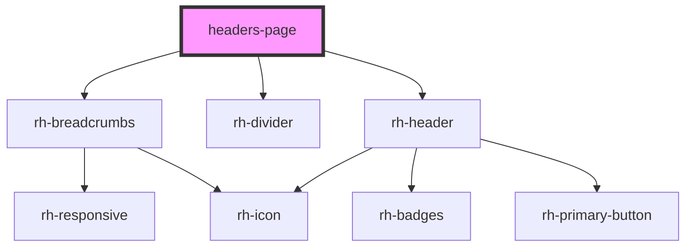

# headers-page

<!-- Auto Generated Below -->

## Properties

| Property  | Attribute | Description | Type            | Default     |
| --------- | --------- | ----------- | --------------- | ----------- |
| `history` | --        |             | `RouterHistory` | `undefined` |

## Dependencies

### Depends on

- [rh-breadcrumbs](../../molecules/breadcrumbs/rh-breadcrumbs.molecule)
- [rh-divider](../../molecules/dividers/rh-divider.molecule)
- [rh-header](../../molecules/header/rh-header.molecule)

### Graph

----------------------------------------------

*Built with [StencilJS](https://stenciljs.com/)*
