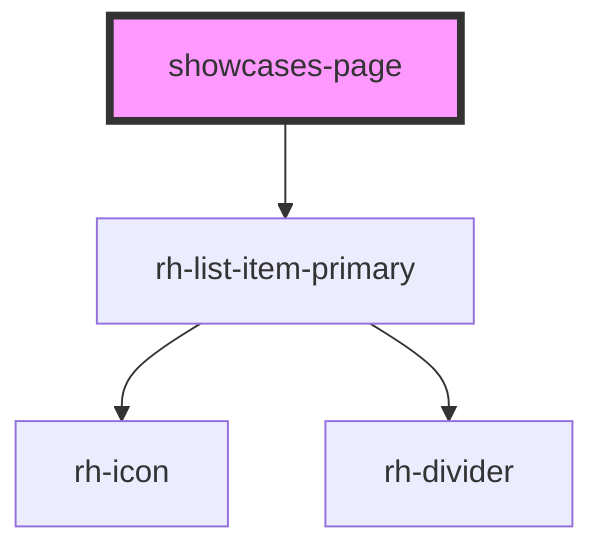

# showcases-page

<!-- Auto Generated Below -->

## Properties

| Property  | Attribute | Description | Type            | Default     |
| --------- | --------- | ----------- | --------------- | ----------- |
| `history` | --        |             | `RouterHistory` | `undefined` |

## Dependencies

### Depends on

- [rh-list-item-primary](../../molecules/list items/rh-list-item-primary.molecule)

### Graph

----------------------------------------------

*Built with [StencilJS](https://stenciljs.com/)*
